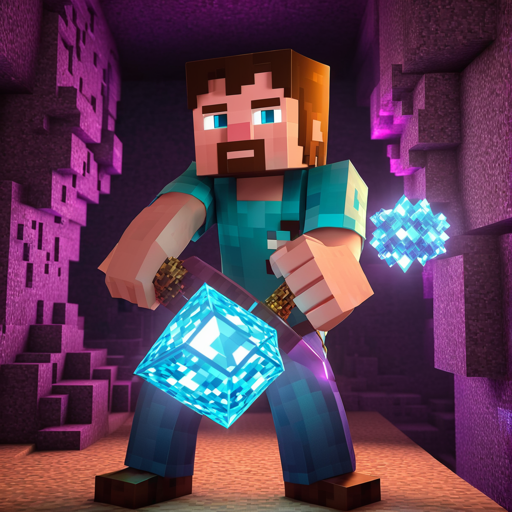

# X-ray 1.19.60 – Minecraft PE Resource Pack
A lightweight X-ray texture pack for **Minecraft PE (Bedrock Edition)** version **1.19.60+**. It highlights **ores** and hides all other blocks (except gravel), making mining fast and efficient. Created by Leo Termado.

---

## 📦 Pack Info

- **Name:** X-ray 1.19.60  
- **Version:** 1.1.0  
- **Release Date:** February 2023  
- **Creator:** Leo Termado  
- **Instagram:** [@leo.tdo](https://instagram.com/leo.tdo)

---

## 📥 How to Use

1. Download all files from this repository onto your **phone**.
2. Place the entire folder into the following location:

   - **iPhone (iOS):**  
     `On My iPhone > Minecraft > games > com.mojang > resource_packs`

   - **Android (likely similar)

3. Open Minecraft PE, go to **Settings > Global Resources**, and activate the X-ray pack under “My Packs”.

---

## 🧱 Features

- See through all blocks except ores and gravel  
- Compatible with Minecraft Bedrock 1.19.60+  
- No mods or tools needed — just a resource pack

---

## 📝 Changelog

**v1.1.0 – February 2023**
- Made it compatible with Minecraft PE 1.19.60

---

## 📸

